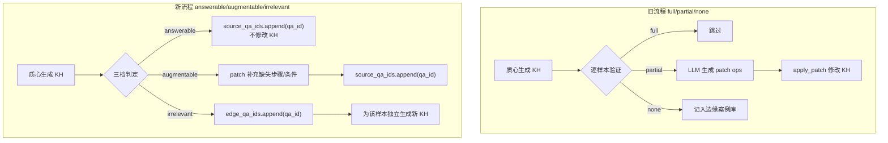
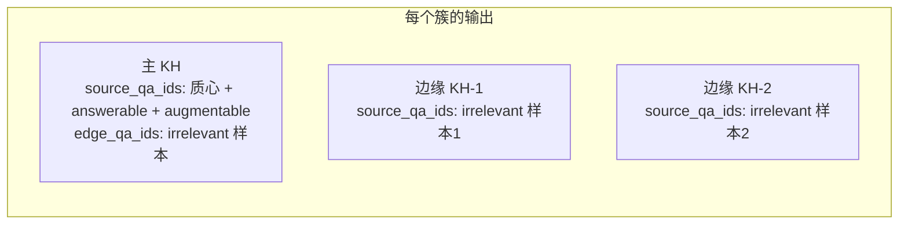

# 知识块 Patch 逻辑重构计划

## 一、核心设计变更概览




**关键变化：**

- 三档语义重新定义：full/partial/none --> answerable/augmentable/irrelevant
  - **answerable**：KH 完全可以推导出与标准答案一致的结论 --> 挂钩 `source_qa_ids`，不修改 KH
  - **augmentable**：KH 方向正确，但缺少该样本提到的具体步骤/条件/例外 --> patch 补充后挂钩 `source_qa_ids`
  - **irrelevant**：KH 与该问题完全无关或核心结论矛盾 --> 挂钩 `edge_qa_ids`，独立生成新 KH
- QA 溯源从 inline footnote（`[1,2,3]`）改为 KH 级别的 `source_qa_ids` / `edge_qa_ids` 数组
- irrelevant 的边缘案例用其 Level 1 KH 文本独立调用 `structured_kh_generate` 生成新 KH
- exceptions 严格仅从 QA 原文/reasoning 提取，LLM 严禁脑补
- 顶层 `constraints` 数组移除，合并到 step 的 `constraint` / `policy_basis` 字段中

## 二、KH JSON Schema 变更

**旧 schema（[prompts_v2.py](know-how-skill/extraction/qa_know_how_build/prompts_v2.py) L11-47）：**

```json
{
  "title": "...", "scope": "...",
  "steps": [{"step":"1","action":"...","condition":"...","outcome":"..."}],
  "exceptions": [{"when":"...","then":"..."}],
  "constraints": ["..."]
}
```

**新 schema：**

```json
{
  "title": "...",
  "scope": "...",
  "source_qa_ids": [],
  "edge_qa_ids": [],
  "steps": [
    {
      "step": "1",
      "action": "具体操作描述",
      "condition": "触发/前置条件（可选，null）",
      "constraint": "约束条件（可选，null）",
      "policy_basis": "政策依据（可选，null）",
      "outcome": "预期结果（可选，null）"
    }
  ],
  "exceptions": [
    {"when": "异常条件", "then": "处理方式"}
  ]
}
```

变更点：

- 新增顶层 `source_qa_ids`（int 数组）和 `edge_qa_ids`（int 数组）-- 由代码填充，不由 LLM 生成
- 移除顶层 `constraints` 数组
- step 新增 `constraint`（约束条件）和 `policy_basis`（政策依据）字段
- `exceptions` 保留但加严格抽取约束（仅当 QA 原文明确提及时才填写）

## 三、需修改的文件及要点

### 3.1 [prompts_v2.py](know-how-skill/extraction/qa_know_how_build/prompts_v2.py)

**KH_JSON_SCHEMA（L11-47）：** 更新为新 schema（不含 `source_qa_ids`/`edge_qa_ids`，由代码填充）。

**structured_kh_generate（L54-104）：**

- 更新 schema 引用和字段填写指引
- step 指引新增 `constraint`（仅当 QA 原文或 reasoning 中明确提到约束条件时填写）和 `policy_basis`（仅当原文提到政策文件名/文号时填写）
- **新增严格约束**：`exceptions` 仅当 QA 原文/reasoning 中有明确文字依据时才填写，LLM 严禁主动推断或脑补任何例外情况。无则留空数组。
- 移除 `constraints` 顶层字段指引

**kh_inference_validate（L154-209）：** 三档语义重写

- Matching Criteria 从 full/partial/none 改为 answerable/augmentable/irrelevant
  - **answerable**：KH 能严格推导出与标准答案在核心结论和关键细节上语义一致的结论
  - **augmentable**：KH 方向正确，但该样本包含 KH 中未覆盖的具体步骤、条件、例外或约束信息，补充后可提升 KH 覆盖面
  - **irrelevant**：KH 与该问题无关，或推理结论与标准答案在核心结论上矛盾
- 输出格式改为：`{"match_level": "answerable|augmentable|irrelevant", "derived_answer": "...", "mismatch_analysis": "..."}`

**kh_minimal_update + PATCH_OPS_SCHEMA（L216-331）：** 保留并更新

- PATCH_OPS_SCHEMA 移除顶层 `add_constraint`/`modify_constraint`/`remove_constraint`
- step 的 `modify_step` 的 updates 新增可选字段 `constraint`、`policy_basis`
- `add_step` 的 `new_step` 也支持 `constraint`、`policy_basis`
- 新增 prompt 约束：`add_exception` 严格限制为仅当新样本原文中明确提及该例外时才可使用
- 操作优先级中移除 `add_constraint`，保留 step 级别操作

**kh_normalize_steps（L338-386）：** 更新以处理新的 step 字段（`constraint`、`policy_basis` 需原样保留）。

**_render_know_how_readable（L111-151）：** 更新渲染逻辑，移除 constraints 渲染，新增 constraint/policy_basis 在 step 中的渲染。

### 3.2 [level2_refine.py](know-how-skill/extraction/qa_know_how_build/v_2/level2_refine.py)

`**_refine_single_cluster`（L110-338）：** 核心重构

Step 1（质心生成，~L135-164）：

- 移除 `append_qa_footnote` 调用（不再需要 inline footnote）
- 生成 KH 后设置 `know_how["source_qa_ids"] = [centroid_index]`，`know_how["edge_qa_ids"] = []`

Step 2（逐样本验证，~L166-281）：三档逻辑重构

```python
if match_level == "answerable":
    know_how["source_qa_ids"].append(s_idx)

elif match_level == "augmentable":
    # 保留 patch 流程：补充该样本提到的缺失步骤/条件
    update_result = kh_minimal_update(...)
    ops = update_result.get("operations", [])
    if ops:
        know_how, patch_log = apply_patch(know_how, ops, qa_index=None)
        applied = [p for p in patch_log if p["status"] == "applied"]
    else:
        applied = []
    if applied:
        know_how["source_qa_ids"].append(s_idx)
    else:
        # patch 全部失败 → 降级为 irrelevant
        know_how["edge_qa_ids"].append(s_idx)
        edge_kh = _generate_edge_kh(sample, llm_func, max_retries_per_step)
        edge_kh_list.append(edge_kh)

else:  # irrelevant
    know_how["edge_qa_ids"].append(s_idx)
    edge_kh = _generate_edge_kh(sample, llm_func, max_retries_per_step)
    edge_kh_list.append(edge_kh)
```

- augmentable 时 patch 后将 qa_id 加入 `source_qa_ids`；**若 patch 全部失败则降级为 irrelevant**：转入 `edge_qa_ids` 并独立生成新 KH
- `apply_patch` 调用时 `qa_index=None`，不再追加 inline footnote

新增 `_generate_edge_kh` 辅助函数：

- 使用 irrelevant 样本的 Level 1 KH 文本 + QA 上下文调用 `structured_kh_generate`
- 设置新 KH 的 `source_qa_ids = [edge_qa_index]`，`edge_qa_ids = []`

Step 4（写入结果，~L307-338）：

- `result` 中新增 `edge_know_hows` 列表，存放 irrelevant 样本独立生成的 KH 块
- `absorbed_indices` 替换为直接引用 `know_how["source_qa_ids"]`
- `edge_case_indices` 替换为直接引用 `know_how["edge_qa_ids"]`

**import 变更：** 保留 `apply_patch` 导入，移除 `append_qa_footnote` 导入。

### 3.3 [patch_engine.py](know-how-skill/extraction/qa_know_how_build/v_2/patch_engine.py)

- 移除 `_op_add_constraint`、`_op_modify_constraint`、`_op_remove_constraint` 及其在 `_OP_DISPATCH` 中的注册
- `_op_add_step` / `_op_modify_step`：step dict 新增 `constraint`、`policy_basis` 为合法字段
- `_tag_affected_element`：移除 footnote 追加逻辑（或整个函数），因为溯源改为 `source_qa_ids` 数组
- `append_qa_footnote` 函数保留但不再被主流程调用

### 3.4 [case_store.py](know-how-skill/extraction/qa_know_how_build/v_2/case_store.py)

- `append_edge_cases` 的 edge case 数据结构更新：新增 `edge_know_how` 字段存储为该 irrelevant 样本独立生成的 KH

### 3.5 [utils.py](know-how-skill/extraction/utils.py)

`**_render_structured_kh`（L87-118）：**

- 移除 `constraints` 渲染段
- step 渲染中新增 `constraint` 和 `policy_basis` 展示

`**_extract_retrieval_text` 及相关检索函数：** 更新以适配新 schema（移除 constraints，新增 step 字段）。

### 3.6 [pipeline.py](know-how-skill/extraction/qa_know_how_build/v_2/pipeline.py)

**Level 2 Markdown 预览（L176-217）：**

- 更新渲染逻辑适配新 schema
- 移除 constraints 段，在 step 中渲染 constraint/policy_basis
- 渲染 source_qa_ids / edge_qa_ids

**edge KH 处理：** 边缘案例生成的独立 KH 需要合并到最终 knowledge.json 输出中

### 3.7 [inference/retrieval.py](know-how-skill/inference/retrieval.py)

`**_render_qa_knowhow`（L349-372）：**

- 移除 `constraints` 渲染循环（L368-370）
- step 渲染中新增 `constraint` 和 `policy_basis` 展示（与 extraction 侧 `_render_structured_kh` 对齐）

`prompts_infer.py` 和 `mapreduce_infer.py` 不直接引用 KH 字段结构，无需修改。

### 3.8 [design.md](know-how-skill/extraction/qa_know_how_build/v_2/design.md)

更新设计文档以反映新的三档验证语义、新 schema、patch 范围变化和边缘案例独立 KH 生成流程。

## 四、数据流




## 五、不变的部分

- Level 1 提炼流程不变
- 聚类逻辑不变
- 通用案例库（general_cases）不变
- 步骤编号归一化（kh_normalize_steps）流程保留，仅更新字段列表
- patch 机制核心保留（apply_patch + patch_engine），仅用于 augmentable 分支

